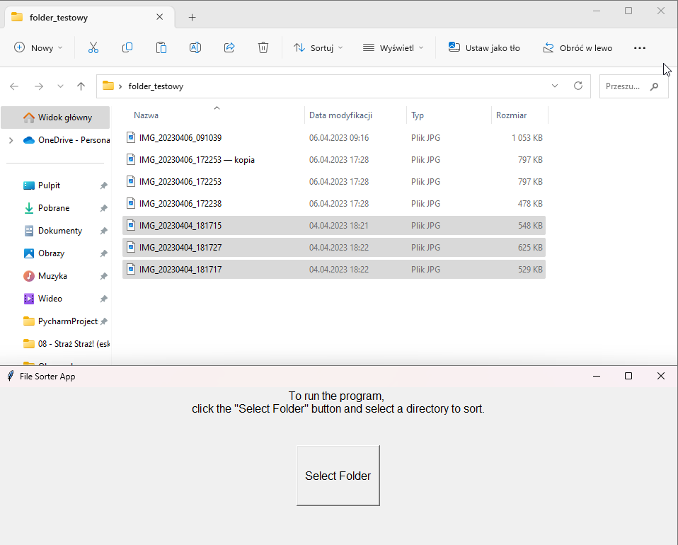
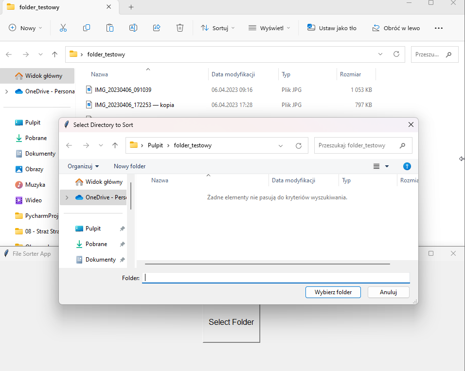
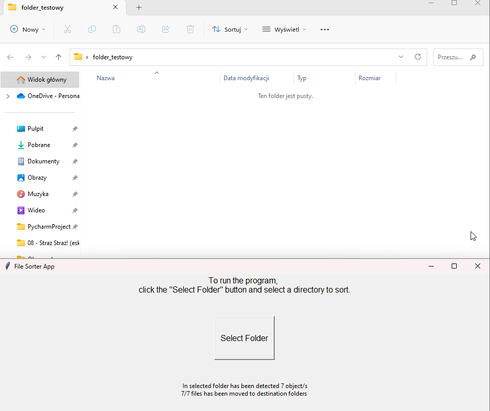

# File Sorter App

> This is a simple application that helps you sort files based on their extensions into 4 specifics categories (Image, Documents, Video, Music). Those categories are basic folders installed into Windowd operation system. These categories are default folders in Windows system with based root path i.e ("C:\Users\Personal_profile_name\Pictures")

## Table of Contents
* [General Information](#general-information)
* [Technologies Used](#technologies-used)
* [Features](#features)
* [Demo](#demo)
* [Setup](#setup)
* [Usage](#usage)
* [Project Status](#project-status)

## General Information
The File Sorter App is designed to help you organize your files by moving them to specific folders based on their file extensions. This aplication was tested on Windows 10 operating system.  It aims to simplify the task of manually sorting files and save time.

## Technologies Used
- Python - version 3.7
- Windows

## Features
- Automatically sorts files into folders based on their file extensions.
- Supports various file extensions for categorization.

## Demo
This is screen before running sorter. Folder "folder testowy" contains pictures files 
 
 
This is screen during selected sorted file

  
This is screen when application done its job and stransfer files to pictures file
 

[](http://www.youtube.com/watch?v=ffNtDCFeqZA)

 

## Setup
To run the File Sorter App, you need to have Python 3.7 or above installed on your system. Then download Main.py file and run program in Python compiler.
1. Clone this repository or download the source code.
2. Install the required libraries by using pip:
3. Navigate to the project directory.
4. Run the following command to start the application:
   ```
   python Main.py
   ```
5. Run program.
6. 
Alternative method of run. 
1. Download "File_Sorter_App"on your computer.
2. Double click on downloaded file.

## Usage
1. Click the "Select Folder" button to choose the directory containing the files you want to sort.
2. The application will automatically move the files to specific folders based on their file extensions.

## Project Status
The project is complete and fully functional.
